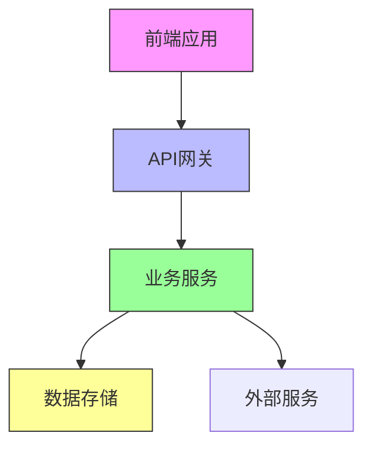

# 🏗️ 架构设计 - {project_name}

## 🎯 总体架构

### 1. 系统架构图


### 2. 技术栈选择

#### 前端技术栈
- **框架**：Vue3
- **UI库**：Element Plus
- **状态管理**：Pinia
- **构建工具**：Vite

#### 后端技术栈
- **框架**：FastAPI
- **数据库**：PostgreSQL
- **缓存**：Redis
- **消息队列**：RabbitMQ

### 3. 数据库设计

#### 核心数据模型
```sql
-- 用户表
CREATE TABLE users (
    id SERIAL PRIMARY KEY,
    username VARCHAR(50) UNIQUE NOT NULL,
    email VARCHAR(100) UNIQUE NOT NULL,
    created_at TIMESTAMP DEFAULT NOW()
);

-- 项目表
CREATE TABLE projects (
    id SERIAL PRIMARY KEY,
    name VARCHAR(100) NOT NULL,
    description TEXT,
    status VARCHAR(20) DEFAULT 'active',
    created_at TIMESTAMP DEFAULT NOW()
);
```

### 4. API设计规范

#### RESTful API规范
- **版本控制**：/api/v1/
- **错误处理**：统一错误格式
- **认证授权**：JWT Token
- **限流策略**：基于IP的限流

#### 接口示例
```json
{
  "endpoint": "GET /api/v1/users",
  "description": "获取用户列表",
  "parameters": {
    "page": "页码",
    "limit": "每页数量"
  },
  "response": {
    "code": 200,
    "data": [],
    "message": "success"
  }
}
```

### 5. 部署架构

#### 环境规划
- **开发环境**：本地Docker
- **测试环境**：测试服务器
- **预生产环境**：预发布环境
- **生产环境**：云服务器集群

#### 容器化部署
```dockerfile
# Dockerfile示例
FROM node:16-alpine
WORKDIR /app
COPY package*.json ./
RUN npm install
COPY . .
EXPOSE 3000
CMD ["npm", "start"]
```

## 🔐 安全设计

### 1. 认证授权
- **用户认证**：JWT + OAuth2
- **权限控制**：RBAC模型
- **API安全**：速率限制 + 输入验证

### 2. 数据安全
- **数据加密**：传输加密HTTPS，存储加密AES
- **传输安全**：SSL/TLS证书
- **备份策略**：每日自动备份，保留30天

## 📊 性能设计

### 1. 性能指标
- **响应时间**：API < 200ms
- **并发能力**：支持1000并发用户
- **可用性**：99.9%服务可用性

### 2. 优化策略
- **缓存策略**：Redis缓存热点数据
- **数据库优化**：索引优化，查询优化
- **CDN加速**：静态资源CDN分发