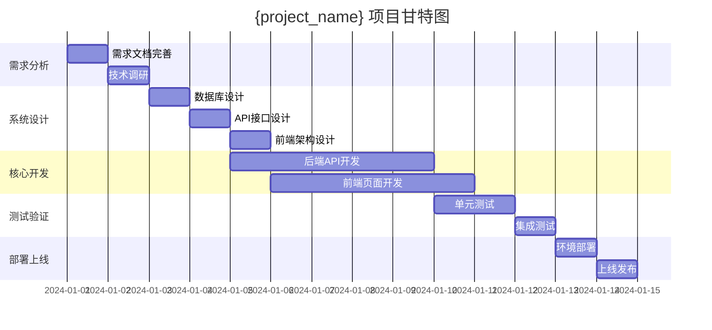

# 🎯 任务分解 - {project_name}

## 📊 项目总览

### 项目信息
- **项目名称**：{project_name}
- **总工期**：
- **团队规模**：
- **技术栈**：

## 🎯 任务清单

### 阶段1：需求分析 (2天)
| 任务ID | 任务描述 | 负责人 | 工期 | 前置任务 | 输出 |
|--------|----------|--------|------|----------|------|
| T1-1 | 需求文档完善 | 产品经理 | 1天 | - | PRD文档 |
| T1-2 | 技术调研 | 架构师 | 1天 | - | 技术方案 |

### 阶段2：系统设计 (3天)
| 任务ID | 任务描述 | 负责人 | 工期 | 前置任务 | 输出 |
|--------|----------|--------|------|----------|------|
| T2-1 | 数据库设计 | 架构师 | 1天 | T1-2 | 数据库设计文档 |
| T2-2 | API接口设计 | 后端工程师 | 1天 | T2-1 | API文档 |
| T2-3 | 前端架构设计 | 前端工程师 | 1天 | T2-2 | 前端架构文档 |

### 阶段3：核心开发 (10天)
| 任务ID | 任务描述 | 负责人 | 工期 | 前置任务 | 输出 |
|--------|----------|--------|------|----------|------|
| T3-1 | 后端API开发 | 后端工程师 | 5天 | T2-2 | 后端服务 |
| T3-2 | 前端页面开发 | 前端工程师 | 5天 | T2-3 | 前端应用 |

### 阶段4：测试验证 (3天)
| 任务ID | 任务描述 | 负责人 | 工期 | 前置任务 | 输出 |
|--------|----------|--------|------|----------|------|
| T4-1 | 单元测试 | 测试工程师 | 2天 | T3-1,T3-2 | 测试报告 |
| T4-2 | 集成测试 | 测试工程师 | 1天 | T4-1 | 测试报告 |

### 阶段5：部署上线 (2天)
| 任务ID | 任务描述 | 负责人 | 工期 | 前置任务 | 输出 |
|--------|----------|--------|------|----------|------|
| T5-1 | 环境部署 | 运维工程师 | 1天 | T4-2 | 生产环境 |
| T5-2 | 上线发布 | 运维工程师 | 1天 | T5-1 | 上线完成 |

## 📈 甘特图

## 🎯 里程碑

| 里程碑 | 完成时间 | 交付物 | 验收标准 |
|--------|----------|--------|----------|
| 需求确认 | 第2天 | 需求文档 | 需求评审通过 |
| 设计完成 | 第5天 | 设计文档 | 设计评审通过 |
| 开发完成 | 第15天 | 可运行系统 | 功能测试通过 |
| 测试完成 | 第18天 | 测试报告 | 质量达标 |
| 上线完成 | 第20天 | 生产系统 | 稳定运行 |

## 📋 风险清单

| 风险描述 | 影响程度 | 概率 | 应对措施 | 负责人 |
|----------|----------|------|----------|--------|
| 需求变更 | 高 | 中 | 需求冻结机制 | 项目经理 |
| 技术难点 | 中 | 低 | 技术预研 | 架构师 |
| 人员变动 | 中 | 低 | 备份人员 | 项目经理 |

## 🔄 任务状态跟踪

### 任务状态定义
- 🟡 **待办**：任务已创建，等待开始
- 🔵 **进行中**：任务正在执行
- 🟢 **已完成**：任务已完成
- 🔴 **阻塞**：任务因依赖或问题暂停

### 每日站会模板
**日期**：
**昨天完成**：
**今天计划**：
**遇到问题**：
**需要支持**：