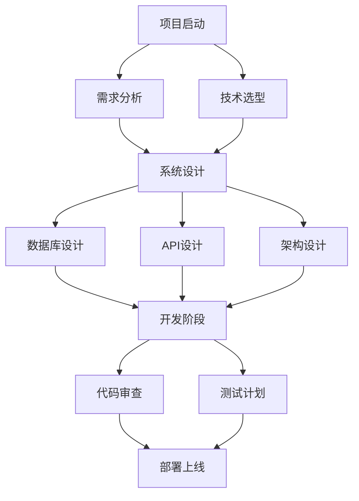

# 📋 Trae AI 模板库

> 项目开发全流程模板集合，覆盖从需求分析到部署上线的完整生命周期

## 🎯 模板分类

### 📋 项目启动模板
| 模板名称 | 用途说明 | 使用场景 |
|----------|----------|----------|
| [project-init-template.md](./project-init-template.md) | 项目初始化完整模板 | 新项目启动、技术选型 |
| [requirements-template.md](./requirements-template.md) | 需求分析文档模板 | 需求收集、功能定义 |
| [tech-choice-template.md](./tech-choice-template.md) | 技术选型对比模板 | 框架选择、方案对比 |

### 🏗️ 系统设计模板
| 模板名称 | 用途说明 | 使用场景 |
|----------|----------|----------|
| [database-design-template.md](./database-design-template.md) | 数据库设计完整模板 | 数据模型设计、表结构设计 |
| [api-spec-template.md](./api-spec-template.md) | API接口规范模板 | RESTful API设计、文档编写 |
| [architecture-template.md](./architecture-template.md) | 系统架构设计模板 | 技术架构、部署架构 |

### 🔍 质量保证模板
| 模板名称 | 用途说明 | 使用场景 |
|----------|----------|----------|
| [test-plan-template.md](./test-plan-template.md) | 测试计划完整模板 | 功能测试、性能测试 |
| [code-review-template.md](./code-review-template.md) | 代码审查模板 | 代码质量检查、同行评议 |

### 🚀 部署运维模板
| 模板名称 | 用途说明 | 使用场景 |
|----------|----------|----------|
| [deployment-template.md](./deployment-template.md) | 部署指南模板 | 生产环境部署、CI/CD配置 |

### 🤖 智能体配置模板
| 模板名称 | 用途说明 | 使用场景 |
|----------|----------|----------|
| [agent-template.json](./agent-template.json) | AI智能体配置模板 | 自定义AI助手创建 |
| [principle-driven-template.json](./principle-driven-template.json) | 原则驱动开发模板 | 规范化开发流程 |

## 🚀 快速开始

### 1️⃣ 选择合适模板
根据项目阶段选择对应模板：
- **项目启动** → project-init-template.md
- **需求分析** → requirements-template.md  
- **技术选型** → tech-choice-template.md
- **数据库设计** → database-design-template.md
- **API设计** → api-spec-template.md

### 2️⃣ 使用模板
```bash
# 复制模板到项目目录
cp .trae/templates/project-init-template.md docs/project-init.md

# 根据项目需求修改模板
# 使用VS Code编辑模板
```

### 3️⃣ AI辅助填充
```bash
# 使用AI智能体帮助填充模板
python .trae/workflows/trae-console.py

# 在控制台中：
"@技术文档工程师 帮我根据这个模板创建项目初始化文档"
```

## 📊 模板使用统计

### 模板完整度
- ✅ 项目启动类: 3个模板
- ✅ 系统设计类: 3个模板  
- ✅ 质量保证类: 2个模板
- ✅ 部署运维类: 1个模板
- ✅ 智能体配置: 2个模板

### 使用建议
| 项目类型 | 推荐模板组合 |
|----------|--------------|
| **Web全栈项目** | project-init + database-design + api-spec + test-plan |
| **API服务项目** | requirements + api-spec + database-design + deployment |
| **移动App项目** | project-init + tech-choice + test-plan + deployment |
| **小型项目** | project-init + requirements + deployment |

## 🔄 模板更新

### 定期更新
```bash
# 同步最新模板
python .trae/workflows/project-init.py sync-templates

# 检查模板更新
python .trae/workflows/agent-suite.py check-templates
```

### 自定义模板
```bash
# 创建自定义模板
python .trae/workflows/agent-suite.py create-template

# 基于现有模板修改
cp .trae/templates/[template-name] docs/custom-[template-name]
```

## 📚 模板使用最佳实践

### 📋 需求阶段
1. **使用 requirements-template.md** 收集需求
2. **使用 tech-choice-template.md** 进行技术选型
3. **使用 principle-driven-template.json** 确保开发规范

### 🏗️ 设计阶段  
1. **使用 database-design-template.md** 设计数据模型
2. **使用 api-spec-template.md** 定义接口规范
3. **使用 project-init-template.md** 规划项目结构

### 💻 开发阶段
1. **使用 agent-template.json** 配置AI开发助手
2. **使用 code-review-template.md** 进行代码审查
3. **使用 test-plan-template.md** 制定测试策略

### 🚀 部署阶段
1. **使用 deployment-template.md** 制定部署方案
2. **使用 test-plan-template.md** 进行上线前验证

## 🎨 模板可视化

### 模板关系图


### 项目生命周期覆盖
```
项目启动 ────────┐
                 ├── 需求分析
                 ├── 技术选型  
                 ├── 架构设计
                 ├── 数据库设计
                 ├── API设计
                 ├── 开发规范
                 ├── 测试策略
                 └── 部署方案
项目完成 ────────┘
```

## 📞 技术支持

### 模板使用帮助
- **文档问题**: @技术文档工程师
- **模板定制**: @系统架构师  
- **使用指导**: @项目经理

### 更新和反馈
- **模板问题反馈**: [提交Issue]
- **新模板建议**: [功能请求]
- **使用案例分享**: [社区讨论]

---

## 🎯 一句话总结

> **从需求到部署，一套模板搞定项目全流程！**

**所有模板都经过实战验证，直接复制粘贴即可使用！**

---
*模板库版本: v2.0 - 2024年12月更新*