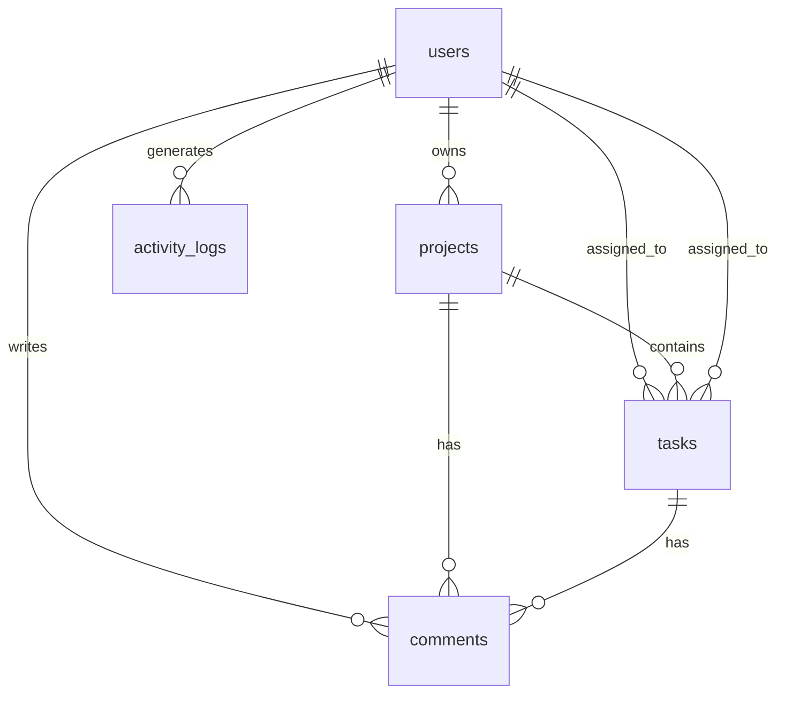

# 🗄️ 数据库设计模板

## 🎯 项目信息
- **项目名称**: [项目名称]
- **数据库类型**: [PostgreSQL/MySQL/MongoDB/SQLite]
- **数据库版本**: [版本号]
- **设计日期**: [当前日期]
- **设计人员**: [设计人员]

## 📊 数据库选型说明

### 选择理由
| 数据库类型 | 选择原因 | 适用场景 |
|-----------|----------|----------|
| [数据库类型] | [选择该数据库的主要原因] | [适用业务场景] |

### 技术特性
- **事务支持**: [是否支持ACID事务]
- **扩展性**: [水平/垂直扩展能力]
- **性能特点**: [读写性能、并发能力]
- **生态工具**: [可用的管理工具和驱动]

## 🏗️ 数据模型设计

### 📋 用户表 (users)
```sql
CREATE TABLE users (
    id UUID PRIMARY KEY DEFAULT gen_random_uuid(),
    username VARCHAR(50) UNIQUE NOT NULL,
    email VARCHAR(255) UNIQUE NOT NULL,
    password_hash VARCHAR(255) NOT NULL,
    first_name VARCHAR(50),
    last_name VARCHAR(50),
    phone VARCHAR(20),
    avatar_url VARCHAR(500),
    is_active BOOLEAN DEFAULT TRUE,
    is_verified BOOLEAN DEFAULT FALSE,
    last_login_at TIMESTAMP,
    created_at TIMESTAMP DEFAULT CURRENT_TIMESTAMP,
    updated_at TIMESTAMP DEFAULT CURRENT_TIMESTAMP
);

-- 索引设计
CREATE INDEX idx_users_email ON users(email);
CREATE INDEX idx_users_username ON users(username);
CREATE INDEX idx_users_created_at ON users(created_at);
```

### 📁 项目表 (projects)
```sql
CREATE TABLE projects (
    id UUID PRIMARY KEY DEFAULT gen_random_uuid(),
    name VARCHAR(100) NOT NULL,
    description TEXT,
    owner_id UUID NOT NULL REFERENCES users(id) ON DELETE CASCADE,
    status VARCHAR(20) DEFAULT 'active' CHECK (status IN ('active', 'archived', 'deleted')),
    start_date DATE,
    end_date DATE,
    budget DECIMAL(12, 2),
    priority INTEGER DEFAULT 1 CHECK (priority BETWEEN 1 AND 5),
    tags TEXT[],
    metadata JSONB,
    created_at TIMESTAMP DEFAULT CURRENT_TIMESTAMP,
    updated_at TIMESTAMP DEFAULT CURRENT_TIMESTAMP
);

-- 索引设计
CREATE INDEX idx_projects_owner ON projects(owner_id);
CREATE INDEX idx_projects_status ON projects(status);
CREATE INDEX idx_projects_created_at ON projects(created_at);
CREATE INDEX idx_projects_tags ON projects USING GIN(tags);
```

### 📝 任务表 (tasks)
```sql
CREATE TABLE tasks (
    id UUID PRIMARY KEY DEFAULT gen_random_uuid(),
    title VARCHAR(200) NOT NULL,
    description TEXT,
    project_id UUID NOT NULL REFERENCES projects(id) ON DELETE CASCADE,
    assignee_id UUID REFERENCES users(id) ON DELETE SET NULL,
    status VARCHAR(20) DEFAULT 'todo' CHECK (status IN ('todo', 'in_progress', 'review', 'done')),
    priority INTEGER DEFAULT 3 CHECK (priority BETWEEN 1 AND 5),
    estimated_hours DECIMAL(4, 2),
    actual_hours DECIMAL(4, 2),
    due_date DATE,
    completed_at TIMESTAMP,
    tags TEXT[],
    attachments JSONB,
    comments_count INTEGER DEFAULT 0,
    created_at TIMESTAMP DEFAULT CURRENT_TIMESTAMP,
    updated_at TIMESTAMP DEFAULT CURRENT_TIMESTAMP
);

-- 索引设计
CREATE INDEX idx_tasks_project ON tasks(project_id);
CREATE INDEX idx_tasks_assignee ON tasks(assignee_id);
CREATE INDEX idx_tasks_status ON tasks(status);
CREATE INDEX idx_tasks_due_date ON tasks(due_date);
CREATE INDEX idx_tasks_priority ON tasks(priority);
CREATE INDEX idx_tasks_created_at ON tasks(created_at);
```

### 💬 评论表 (comments)
```sql
CREATE TABLE comments (
    id UUID PRIMARY KEY DEFAULT gen_random_uuid(),
    content TEXT NOT NULL,
    author_id UUID NOT NULL REFERENCES users(id) ON DELETE CASCADE,
    task_id UUID REFERENCES tasks(id) ON DELETE CASCADE,
    project_id UUID REFERENCES projects(id) ON DELETE CASCADE,
    parent_id UUID REFERENCES comments(id) ON DELETE CASCADE,
    is_edited BOOLEAN DEFAULT FALSE,
    created_at TIMESTAMP DEFAULT CURRENT_TIMESTAMP,
    updated_at TIMESTAMP DEFAULT CURRENT_TIMESTAMP
);

-- 索引设计
CREATE INDEX idx_comments_author ON comments(author_id);
CREATE INDEX idx_comments_task ON comments(task_id);
CREATE INDEX idx_comments_project ON comments(project_id);
CREATE INDEX idx_comments_parent ON comments(parent_id);
```

### 📊 活动日志表 (activity_logs)
```sql
CREATE TABLE activity_logs (
    id UUID PRIMARY KEY DEFAULT gen_random_uuid(),
    user_id UUID NOT NULL REFERENCES users(id) ON DELETE CASCADE,
    action VARCHAR(50) NOT NULL,
    entity_type VARCHAR(20) NOT NULL CHECK (entity_type IN ('project', 'task', 'comment', 'user')),
    entity_id UUID NOT NULL,
    changes JSONB,
    ip_address INET,
    user_agent TEXT,
    created_at TIMESTAMP DEFAULT CURRENT_TIMESTAMP
);

-- 索引设计
CREATE INDEX idx_logs_user ON activity_logs(user_id);
CREATE INDEX idx_logs_entity ON activity_logs(entity_type, entity_id);
CREATE INDEX idx_logs_action ON activity_logs(action);
CREATE INDEX idx_logs_created_at ON activity_logs(created_at);
```

## 🔗 关系设计

### 实体关系图


### 关系说明
| 关系类型 | 描述 | 约束 |
|----------|------|------|
| 一对多 | 用户拥有多个项目 | CASCADE删除 |
| 一对多 | 项目包含多个任务 | CASCADE删除 |
| 一对多 | 任务有多个评论 | CASCADE删除 |
| 多对一 | 任务分配给用户 | SET NULL删除 |

## 📊 数据字典

### 用户表字段说明
| 字段名 | 数据类型 | 约束 | 描述 |
|--------|----------|------|------|
| id | UUID | PRIMARY KEY | 用户唯一标识 |
| username | VARCHAR(50) | UNIQUE, NOT NULL | 用户名 |
| email | VARCHAR(255) | UNIQUE, NOT NULL | 邮箱地址 |
| password_hash | VARCHAR(255) | NOT NULL | 密码哈希 |
| is_active | BOOLEAN | DEFAULT TRUE | 账户激活状态 |
| is_verified | BOOLEAN | DEFAULT FALSE | 邮箱验证状态 |

### 项目表字段说明
| 字段名 | 数据类型 | 约束 | 描述 |
|--------|----------|------|------|
| id | UUID | PRIMARY KEY | 项目唯一标识 |
| name | VARCHAR(100) | NOT NULL | 项目名称 |
| owner_id | UUID | FOREIGN KEY | 项目所有者 |
| status | VARCHAR(20) | CHECK约束 | 项目状态 |
| tags | TEXT[] | 数组类型 | 项目标签 |
| metadata | JSONB | JSON存储 | 扩展元数据 |

## 🔍 性能优化

### 索引策略
1. **主键索引**: 所有表的UUID主键
2. **唯一索引**: username, email等唯一字段
3. **外键索引**: 所有外键字段
4. **查询索引**: 常用查询条件的字段
5. **复合索引**: 多字段组合查询

### 分区策略
- **时间分区**: activity_logs按月份分区
- **用户分区**: 大型用户表按用户ID哈希分区

### 缓存策略
- **查询缓存**: 频繁查询的用户信息
- **结果缓存**: 复杂的统计查询结果
- **会话缓存**: 用户登录状态

## 🛡️ 安全设计

### 数据安全
- **敏感数据加密**: 邮箱、电话等PII信息
- **密码安全**: bcrypt哈希 + 盐值
- **审计日志**: 所有数据变更记录

### 访问控制
- **行级安全**: 基于用户ID的数据访问
- **列级安全**: 敏感字段访问控制
- **时间窗口**: 数据访问时间限制

## 📈 扩展设计

### 水平扩展
- **读写分离**: 主从复制架构
- **分片策略**: 按用户ID范围分片
- **连接池**: 数据库连接池管理

### 垂直扩展
- **硬件升级**: CPU、内存、存储
- **配置优化**: 缓冲区、连接数
- **查询优化**: SQL语句优化

## 🔧 维护计划

### 日常维护
- **数据备份**: 每日全量备份
- **日志清理**: 定期清理过期日志
- **性能监控**: 查询性能监控

### 定期维护
- **索引重建**: 每月重建碎片化索引
- **统计更新**: 更新表统计信息
- **容量规划**: 存储容量预测和扩展

## 📊 监控指标

### 性能指标
- **查询响应时间**: P95 < 100ms
- **并发连接数**: 监控连接池使用
- **慢查询**: 记录执行时间 > 1s的查询

### 业务指标
- **活跃用户数**: 日/周/月活跃用户
- **数据增长率**: 每日新增数据量
- **错误率**: 数据库操作错误率

## 🚀 部署脚本

### 初始化脚本
```sql
-- 创建数据库
CREATE DATABASE project_db OWNER db_user;

-- 创建扩展
CREATE EXTENSION IF NOT EXISTS "uuid-ossp";
CREATE EXTENSION IF NOT EXISTS "pg_trgm";

-- 创建schema
CREATE SCHEMA IF NOT EXISTS app;
```

### 迁移脚本
```sql
-- 版本控制表
CREATE TABLE schema_migrations (
    version VARCHAR(50) PRIMARY KEY,
    applied_at TIMESTAMP DEFAULT CURRENT_TIMESTAMP
);
```

## 📚 相关文档
- [数据库配置指南](database-setup.md)
- [性能调优指南](performance-tuning.md)
- [备份恢复方案](backup-restore.md)
- [监控告警配置](monitoring.md)