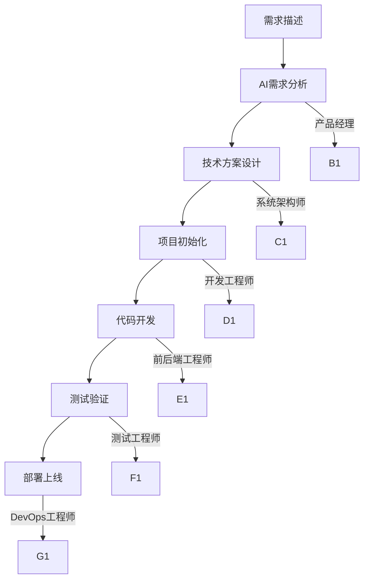

<div align="center">

# 🚀 Trae AI 超级团队

**一个命令，19个AI专家为你工作！** 

[](https://github.com/your-username/learn_trae)
[](https://www.python.org/)
[](LICENSE)
[](https://github.com/your-username/learn_trae/commits)
[](https://github.com/your-username/learn_trae/issues)

### 🎯 **复制即用 · 零配置 · 19个AI专家协作开发**

**中文友好 | 跨平台支持 | 企业级开发工作流**

</div>

---

## ✨ 核心特性

<div align="center">

| 🎭 **19个AI专家** | 🚀 **一键启动** | 🔧 **零配置** | 📱 **跨平台** |
|:-----------------:|:---------------:|:-------------:|:-------------:|
| 产品经理+架构师+开发工程师 | 一个命令开始开发 | 复制即用 | Win/Mac/Linux |

| 🎯 **项目模板** | 🔄 **智能协作** | 📊 **企业级** | 🌐 **中文优先** |
|:---------------:|:---------------:|:-------------:|:-------------:|
| 7种技术栈模板 | AI团队协同工作 | 生产环境就绪 | 完整中文支持 |

</div>

---

## 🎬 30秒快速开始

### 🎯 方式1：控制台模式（推荐）
```bash
# 克隆项目
git clone https://github.com/your-username/learn_trae.git
cd learn_trae

# 启动AI控制台
python .trae\trae-console.py

# 输入你的需求：
# "创建一个Vue3+TypeScript的任务管理系统"
```

### 🎯 方式2：开发助手模式
```bash
# 直接创建项目
python .trae-dev.py "@产品经理 创建React电商平台"

# 或专业咨询
python .trae-dev.py "@系统架构师 如何设计微服务架构？"
```

### 🎯 方式3：命令行模式
```bash
# 创建新项目
python .trae\trae-console.py create "我的新项目"

# 查看项目列表
python .trae\trae-console.py list
```

---

## 🎭 19个AI专家团队

### 👔 管理层 (4人)
| 角色 | 专长 | 使用示例 |
|------|------|----------|
| **产品经理** | 需求分析、产品设计 | `@产品经理 设计一个Todo应用` |
| **系统架构师** | 技术架构、系统设计 | `@系统架构师 微服务如何拆分？` |
| **项目经理** | 项目规划、进度管理 | `@项目经理 制定开发计划` |
| **项目协调员** | 团队协作、任务分配 | `@项目协调员 分配开发任务` |

### 💻 前端开发 (5人)
| 角色 | 技术栈 | 使用示例 |
|------|--------|----------|
| **Vue工程师** | Vue3 + TypeScript + Vite | `@Vue工程师 创建响应式表格组件` |
| **React工程师** | React18 + Hooks + Next.js | `@React工程师 实现状态管理` |
| **Angular工程师** | Angular15+企业级开发 | `@Angular工程师 设计模块化架构` |
| **Uniapp工程师** | 小程序 + App跨平台 | `@Uniapp工程师 开发微信小程序` |
| **Flutter工程师** | 跨平台移动应用 | `@Flutter工程师 创建iOS/Android应用` |

### 🔧 后端开发 (5人)
| 角色 | 技术栈 | 使用示例 |
|------|--------|----------|
| **Python工程师** | FastAPI/Django/Flask | `@Python工程师 设计RESTful API` |
| **FastAPI工程师** | FastAPI专业开发 | `@FastAPI工程师 创建高性能API` |
| **Node工程师** | Express/Nest.js服务端 | `@Node工程师 实现GraphQL接口` |
| **Go工程师** | Go语言高性能后端 | `@Go工程师 开发微服务` |
| **Rust工程师** | Rust系统级开发 | `@Rust工程师 实现高并发服务` |

### 🎯 专项技术 (5人)
| 角色 | 专长 | 使用示例 |
|------|------|----------|
| **测试工程师** | 自动化测试、质量保证 | `@测试工程师 设计测试用例` |
| **DevOps工程师** | CI/CD、容器化部署 | `@DevOps工程师 配置Docker部署` |
| **UI/UX设计师** | 界面设计、用户体验 | `@UI/UX设计师 设计现代化界面` |
| **技术文档工程师** | 文档编写、API文档 | `@技术文档工程师 生成API文档` |
| **C++部署工程师** | C++系统部署优化 | `@C++部署工程师 优化系统性能` |

---

## 🚀 项目模板库

### 📋 即用模板

| 模板 | 技术栈 | 适用场景 | 一键创建 |
|------|--------|----------|----------|
| **🌐 Web应用** | Vue3 + FastAPI + PostgreSQL | 管理后台、企业应用 | `vue3-fastapi-template` |
| **🛒 电商平台** | React18 + Node.js + MongoDB | 在线商城、交易系统 | `react-ecommerce-template` |
| **📱 移动应用** | Flutter + Firebase | 跨平台App | `flutter-mobile-template` |
| **💬 小程序** | Uniapp + SpringBoot | 微信/支付宝小程序 | `uniapp-miniprogram-template` |
| **⚡ API服务** | FastAPI + PostgreSQL | 后端API服务 | `fastapi-api-template` |
| **📝 静态网站** | Next.js + Vercel | 博客、官网 | `nextjs-static-template` |
| **🖥️ 桌面应用** | Electron + Vue3 | 跨平台桌面软件 | `electron-desktop-template` |

---

## 🎯 实际使用案例

### 案例1：Vue3任务管理系统
```bash
# 启动控制台
python .trae\trae-console.py

# 输入需求：
"创建一个Vue3+TypeScript的任务管理系统，需要：
- 用户登录/注册
- 任务CRUD操作  
- 拖拽排序功能
- 状态管理（待办/进行中/完成）
- 本地存储持久化
- 响应式设计支持移动端"
```

**AI团队响应：**
- 📋 **产品经理**：输出需求文档和原型设计
- 🏗️ **系统架构师**：设计技术架构和数据库结构
- ⚡ **Vue工程师**：创建项目结构和核心组件
- 🔧 **FastAPI工程师**：设计RESTful API接口
- 🎨 **UI/UX设计师**：提供界面设计方案

### 案例2：React电商平台
```bash
# 开发助手模式
python .trae-dev.py "@产品经理 创建React电商平台，包含商品展示、购物车、订单管理、支付集成"

# 专业咨询
python .trae-dev.py "@系统架构师 电商平台如何设计高并发架构？"
python .trae-dev.py "@DevOps工程师 如何用Docker部署电商应用？"
```

---

## 🛠️ 开发工作流

### 🔄 标准开发流程


### 📊 项目生命周期
1. **需求阶段** - 产品经理分析需求
2. **设计阶段** - 架构师设计系统
3. **开发阶段** - 前后端工程师编码
4. **测试阶段** - 测试工程师验证
5. **部署阶段** - DevOps工程师上线

---

## 🎯 快速开始指南

### 🏃‍♂️ 极速体验（30秒）
```bash
# 1. 克隆项目
git clone https://github.com/your-username/learn_trae.git
cd learn_trae

# 2. 启动AI控制台
python .trae\trae-console.py

# 3. 输入需求开始开发！
```

### 📚 新手入门（3天计划）

#### 第1天：熟悉系统
```bash
# 启动控制台
python .trae\trae-console.py

# 尝试："创建一个简单的Hello World应用"
# 观察19个AI如何协作
```

#### 第2天：项目实践
```bash
# 创建第一个完整项目
python .trae-dev.py "@产品经理 创建一个Vue3待办事项应用"
```

#### 第3天：专业咨询
```bash
# 向专业智能体提问
python .trae-dev.py "@系统架构师 如何设计微服务架构？"
python .trae-dev.py "@Vue工程师 Vue3的Composition API最佳实践？"
```

---

## 🔧 高级功能

### 🎛️ 控制台命令
```bash
# 查看所有智能体
python .trae\trae-console.py list-agents

# 创建特定类型项目
python .trae\trae-console.py create --type vue3 --name my-app

# 专业咨询
python .trae\trae-console.py consult "@技术栈选择" "前端框架对比"

# 项目列表
python .trae\trae-console.py list

# 项目详情
python .trae\trae-console.py show [项目名]
```

### 🎯 专业咨询示例
```bash
# 架构咨询
python .trae-dev.py "@系统架构师 单体架构vs微服务如何选择？"

# 技术选型
python .trae-dev.py "@Python工程师 FastAPI和Django哪个更适合API开发？"

# 性能优化
python .trae-dev.py "@DevOps工程师 如何优化Docker镜像大小？"
```

---

## 🌟 社区和贡献

### 🤝 如何贡献
我们欢迎所有形式的贡献！

- 🐛 **报告Bug** - 创建Issue
- 💡 **功能建议** - 提交Feature Request  
- 📖 **文档改进** - 完善README
- 🌍 **翻译贡献** - 多语言支持
- 🎨 **模板创建** - 添加新项目模板

### 📊 开发路线图
- [ ] 智能代码审查
- [ ] 性能监控面板
- [ ] 云端部署集成
- [ ] 团队协作功能
- [ ] VSCode插件
- [ ] 移动端管理App

### 💬 加入社区
- 📧 **讨论组**：[GitHub Discussions](https://github.com/your-username/learn_trae/discussions)
- 💬 **微信群**：扫描下方二维码
- 🐦 **Twitter**：[@trae_ai](https://twitter.com/trae_ai)
- 📺 **B站**：搜索"Trae AI超级团队"

---

## 📄 许可证

本项目采用 [MIT 许可证](LICENSE) - 查看 [LICENSE](LICENSE) 文件了解详情。

---

## 🙏 致谢

感谢以下项目给予灵感和支持：

- [LangChain](https://github.com/langchain-ai/langchain) - AI应用框架
- [FastAPI](https://github.com/tiangolo/fastapi) - 现代Python Web框架  
- [Vue.js](https://github.com/vuejs/vue) - 渐进式JavaScript框架
- [React](https://github.com/facebook/react) - 用户界面库

---

<div align="center">

### 🎯 **让19个AI专家为你的项目工作！**

**[⭐ 给项目点星支持](#) · [🚀 立即开始](#-30秒快速开始) · [📖 查看文档](#-快速开始指南)**

</div>