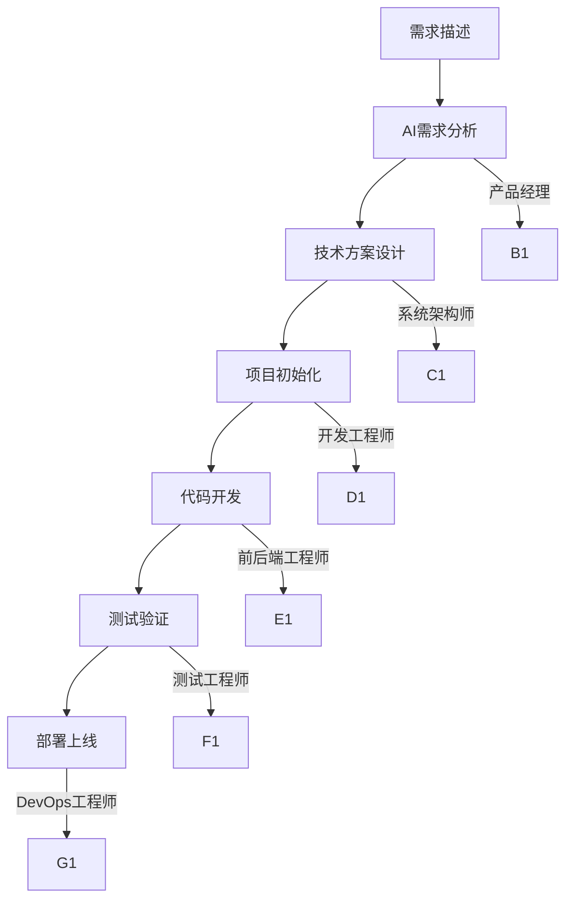

<div align="center">

# 🚀 Trae AI 超级团队 v4.0

**一个命令，20个AI专家为你工作！**

[](https://www.python.org/)
[](LICENSE)
[](.trae/.trae-config.json)

### 🎯 **复制即用 · 零配置 · 20个AI专家协作开发**

**中文友好 | 跨平台支持 | 企业级开发工作流 | MCP支持 | SOLO模式**

</div>

---

## 📋 3秒导航（选择你的需求）

| 🚀 立即开始               | 🎭 20个专家                   | 📋 模板系统                       | 🔧 技术细节                               | 🆘 需要帮助                                    |
| ------------------------ | ---------------------------- | -------------------------------- | ---------------------------------------- | --------------------------------------------- |
| [3秒上手](#-3秒快速开始) | [专家列表](#-20个ai专家团队) | [一键模板](#-模板自动化系统)     | [技术架构](.trae/README.md)              | [故障排除](.trae/README.md#-故障排除2025新版) |
| [实战案例](#-实战案例)   | [使用示例](#-使用示例)       | [效率对比](#-模板自动化效率对比) | [完整手册](.trae/rules/project_rules.md) | [核心原则](.trae/principles.md)               |

---

---

## ✨ 项目亮点（一眼看懂）

| 🎯 **核心优势** | 🚀 **实际效果**                             |
| -------------- | ------------------------------------------ |
| **20个AI专家** | 产品经理+架构师+开发工程师+测试工程师      |
| **一键启动**   | 一个命令开始完整开发流程                   |
| **零配置**     | 复制即用，无需任何环境配置                 |
| **跨平台**     | Windows/Mac/Linux完美兼容                  |
| **7种技术栈**  | Vue3/React/Flutter/FastAPI/Node.js/Go/Rust |
| **模板自动化** | 30秒生成完整项目框架                       |
| **企业级标准** | 生产环境就绪的代码规范                     |
| **中文优先**   | 完整中文文档和示例                         |
| **MCP支持**    | 连接外部工具和数据源（文件系统、搜索、数据库等） |
| **SOLO模式**   | AI主导自动推进开发任务                     |
| **上下文管理** | 支持#Web和#Doc引用，精准获取上下文         |
| **智能体市场** | 智能体分享和组合，可扩展的AI生态           |

---

## 🆕 v4.0 新特性（2025年升级）

### 🤝 Cursor AI Rules 集成

Trae AI v4.0 已集成 [Cursor AI Rules](https://github.com/wangqiqi/cursor-ai-rules)，提供智能协作规则系统，让AI真正理解你的项目和需求：

- 🧠 **智能感知** - 自动分析项目结构、技术栈和团队动态
- 🤝 **AI共生宪法** - 人机协作的核心原则和最高准则
- 🛡️ **安全保障** - 内置风险控制和隐私保护机制
- ⚡ **即插即用** - 3分钟部署，立即提升AI协作效率

### 🚀 MCP（模型上下文协议）支持

Trae AI v4.0 现在支持 MCP 协议，可以连接各种外部工具和数据源：

```bash
# MCP 配置文件位置
.trae/mcp-config.json

# 支持的服务器
- filesystem      # 本地文件系统访问
- brave-search    # 网络搜索
- postgres        # PostgreSQL 数据库
- sqlite          # SQLite 数据库
- supabase        # Supabase 平台
- figma           # Figma 设计工具
- github          # GitHub 代码仓库
- gitlab          # GitLab 代码仓库
```

### 🤖 SOLO 模式

全新的 SOLO 模式让 AI 主导任务，自动推进开发：

```bash
# 启动 SOLO 模式
python .trae/workflows/trae-console.py --mode solo

# 自然语言输入，AI 自动分解任务
"创建一个带用户认证的 Vue3 任务管理系统"

# AI 自动完成：
✅ 需求理解
✅ 架构设计
✅ 代码实现
✅ 测试验证
```

### 📚 上下文管理（#Web 和 #Doc）

使用上下文引用功能，精准获取所需信息：

```bash
# 引用网络资源
#Web https://vuejs.org/guide/introduction.html

# 引用文档集
#Doc .trae/docs/vue3-best-practices.md

# 结合使用
@Vue工程师 根据 #Web https://v3.vuejs.org/ 创建一个响应式组件
```

### 🎭 智能体市场

智能体现在可以分享和组合，构建可扩展的 AI 生态：

```json
{
  "marketplace": {
    "shareable": true,
    "composable": true,
    "market_url": "https://marketplace.trae.ai/agents/vue-engineer",
    "dependencies": [
      "@技术文档工程师",
      "@测试工程师"
    ]
  }
}
```

### 📋 12 个核心原则（完整覆盖）

v4.0 完整实现了 12 个核心开发原则：

| 原则编号 | 原则名称             | 核心内容                           |
| -------- | -------------------- | ---------------------------------- |
| P-001    | 需求澄清原则         | 明确功能需求、技术约束、预期目标   |
| P-002    | 技术选型对比原则     | 多方案对比，选择最优技术栈         |
| P-003    | 文档驱动开发原则     | 文档先行，代码后行                 |
| P-004    | 渐进式实施原则       | 小步快跑，持续交付                 |
| P-005    | 自动化文档生成原则   | 代码即文档，自动生成               |
| P-006    | 高效沟通协作原则     | 结构化沟通，避免误解               |
| P-007    | 时间信息原则         | 明确时间节点，合理安排进度         |
| P-008    | 结构化沟通原则       | 使用标准化格式，提高沟通效率       |
| P-009    | 测试优先原则         | 测试先行，质量保障                 |
| P-010    | 安全优先原则         | 安全第一，防范风险                 |
| P-011    | 性能优化原则         | 性能导向，持续优化                 |
| P-012    | 可持续维护原则       | 代码规范，易于维护                 |

---

## 🚀 3秒快速开始（选择你的风格）

| 用户类型       | 操作步骤                                            | 预计时间 |
| -------------- | --------------------------------------------------- | -------- |
| **🟢 新手用户** | 复制`.trae` → 完成！                                | 3秒      |
| **🟡 效率用户** | `python .trae/trae.py start`                        | 5秒      |
| **🔵 专业用户** | `python .trae/workflows/trae-console.py` → 输入需求 | 10秒     |
| **🟣 SOLO模式** | `python .trae/workflows/trae-console.py --mode solo` | 10秒     |

### 🎯 实战示例
```bash
# 场景1：快速创建Vue3项目
python .trae/workflows/template-manager.py create --name todo-app --type vue3

# 场景2：AI增强创建电商网站
python .trae/workflows/template-manager.py ai-create --name ecommerce --features "用户认证 商品管理 购物车"

# 场景3：进入AI控制台对话（IDE模式）
python .trae/workflows/trae-console.py
# 输入："创建一个带用户认证的Vue3任务管理系统"

# 场景4：使用SOLO模式（AI主导）
python .trae/workflows/trae-console.py --mode solo
# 输入："创建一个带用户认证的Vue3任务管理系统"
# AI 自动完成：需求理解 → 架构设计 → 代码实现 → 测试验证

# 场景5：使用上下文引用
@Vue工程师 根据 #Web https://v3.vuejs.org/ 创建一个响应式组件

# 场景6：使用MCP连接外部数据源
@Python工程师 使用 MCP postgres 服务器查询用户数据
```

---

## 🎭 20个AI专家团队（完整覆盖）

| 类别         | 专家角色                                                        | 一句话介绍                                                 |
| ------------ | --------------------------------------------------------------- | ---------------------------------------------------------- |
| **管理层**   | 产品经理、系统架构师、项目经理、项目协调员                      | 从需求到部署的全流程管理                                   |
| **前端开发** | Vue/React/Angular/Uniapp/Flutter工程师                          | 覆盖所有主流前端技术栈                                     |
| **后端开发** | Python/FastAPI/Node/Go/Rust工程师                               | 高性能后端开发全覆盖                                       |
| **专项技术** | 测试/DevOps/UI/文档/C++/环境工程师/泛知聊伴(UniversalChatBuddy) | 专业领域深度支持，其中泛知聊伴提供上下文感知的只读对话协助 |

### 🎯 使用示例
```bash
# 向特定专家提问
python .trae/workflows/trae-console.py
# 输入："@Vue工程师 创建一个响应式表格组件"

# 团队协作模式
python .trae/workflows/trae-console.py
# 输入："@产品经理 帮我设计需求，然后@Vue工程师实现前端"

# 使用泛知聊伴智能体（上下文感知对话）
# 在IDE聊天面板中直接提问，智能体会自动感知当前上下文
# 例如："帮我分析这段代码中的性能问题"（自动识别当前文件）
# 或："这个错误是什么意思？"（自动参考终端错误信息）
```

---

## 🚀 模板系统（一键生成）

### 🎯 核心模板速查
| 项目类型     | 一键命令                                                      | 技术栈               | 包含功能                         |
| ------------ | ------------------------------------------------------------- | -------------------- | -------------------------------- |
| **电商网站** | `python .trae/workflows/template-manager.py create ecommerce` | Vue3 + FastAPI       | 用户认证、商品管理、购物车、支付 |
| **管理后台** | `python .trae/workflows/template-manager.py create admin`     | Vue3 + ElementPlus   | 用户管理、权限控制、数据统计     |
| **移动App**  | `python .trae/workflows/template-manager.py create mobile`    | Flutter + FastAPI    | 跨平台、推送通知、离线存储       |
| **API服务**  | `python .trae/workflows/template-manager.py create api`       | FastAPI + PostgreSQL | RESTful API、认证授权、文档生成  |

### 🚀 模板使用示例
```bash
# 查看所有模板
python .trae/workflows/template-manager.py list

# 快速创建Vue3项目
python .trae/workflows/template-manager.py create --name my-app --type vue3

# AI智能创建（描述需求即可）
python .trae/workflows/template-manager.py ai-create --description "创建一个带用户认证的Vue3任务管理系统"
```

---

## 🎯 模板自动化使用案例（全新）

### 案例1：Vue3电商网站（模板自动化演示）

```bash
# 1. 启动模板控制台
python .trae/quick-start.py

# 2. 描述需求（自然语言）
"创建一个Vue3电商网站，需要用户登录、商品管理、购物车、支付功能"

# 3. AI自动完成（30分钟内）：
# ✅ 项目初始化文档（project-init-template）
# ✅ 完整需求分析（requirements-template）
# ✅ RESTful API规范（api-spec-template）
# ✅ 数据库设计方案（database-design-template）
# ✅ 测试计划用例（test-plan-template）
# ✅ Docker部署配置（deployment-template）

# 4. 开始AI协作开发
"@Vue工程师 创建商品列表组件"
"@Python工程师 设计商品管理API"
"@测试工程师 编写商品测试用例"
```

### 案例2：FastAPI用户系统（一键生成）

```bash
# 快速创建完整项目
python .trae/workflows/trae-console-enhanced.py quick \
  --type fastapi \
  --name user-auth-system \
  --features "用户注册 登录认证 JWT令牌 权限管理 文件上传"

# 自动生成：
# 📁 项目结构
# 📋 需求文档（requirements.md）
# 🔧 API规范（api-spec.md）
# 🗄️ 数据库设计（database-design.md）
# ✅ 测试计划（test-plan.md）
# 🚀 部署方案（deployment.md）
```

### 案例3：模板组合使用（高级用法）

```bash
# 手动选择模板组合
python .trae/workflows/template-manager.py interactive

# 选择以下模板：
# 1. project-init-template     # 项目初始化
# 2. requirements-template     # 需求分析
# 3. api-spec-template        # API规范
# 4. database-design-template # 数据库设计
# 5. test-plan-template       # 测试计划

# AI智能填充内容：
# - 根据项目类型自动推荐技术栈
# - 根据功能需求自动生成API接口
# - 根据业务场景自动设计数据库表
# - 根据开发周期自动安排测试计划
```

## 📊 模板自动化效率对比

| 开发阶段   | 传统方式      | Trae AI模板 | 节省时间   | 质量提升   |
| ---------- | ------------- | ----------- | ---------- | ---------- |
| 项目初始化 | 2-4小时       | 5分钟       | 95%        | ✅ 标准化   |
| 需求文档   | 4-6小时       | 10分钟      | 90%        | ✅ 结构化   |
| API设计    | 2-4小时       | 15分钟      | 85%        | ✅ RESTful  |
| 数据库设计 | 2-3小时       | 10分钟      | 80%        | ✅ 规范化   |
| 测试计划   | 2-3小时       | 15分钟      | 85%        | ✅ 全覆盖   |
| 部署配置   | 1-2小时       | 5分钟       | 90%        | ✅ 生产级   |
| **总计**   | **13-22小时** | **1小时**   | **90-95%** | **企业级** |

---

## 🛠️ 开发工作流

### 🔄 标准开发流程



### 📊 项目生命周期

1. **需求阶段** - 产品经理分析需求
2. **设计阶段** - 架构师设计系统
3. **开发阶段** - 前后端工程师编码
4. **测试阶段** - 测试工程师验证
5. **部署阶段** - DevOps工程师上线

---

## 📖 文档体系说明

### 双层文档结构

我们提供了两个层次的文档，满足不同用户需求：

**📋 项目主页文档**（你正在看的这个）

- 📍 **面向**：所有GitHub访客和新手用户
- 📚 **内容**：项目介绍、快速开始、使用案例、项目模板
- 🎯 **用途**：了解项目、快速上手、技术选型

**🔧 系统内部文档**

- 📍 **面向**：实际使用Trae系统的开发者
- 📚 **内容**：详细技术架构、20个AI智能体完整介绍、故障排除、高级配置
- 📂 **位置**：`.trae/README.md`
- 🎯 **用途**：深度使用、问题排查、高级功能

### 📋 如何根据需求选择文档

| 你的需求             | 推荐阅读                             |
| -------------------- | ------------------------------------ |
| 第一次了解项目       | 继续阅读当前页面                     |
| 准备开始使用         | 查看下方"🎬 30秒快速开始"             |
| 需要详细技术文档     | 查看 `.trae/README.md`               |
| 遇到问题需要排查     | 查看 `.trae/README.md`的故障排除部分 |
| 想了解20个AI专家详情 | 查看 `.trae/README.md`的智能体介绍   |

---

## 🎯 快速开始指南

### 🏃‍♂️ 极速体验（30秒）

```bash
# 进入项目目录
cd learn_trae

# 2. 启动AI控制台
python .trae\trae-console.py

# 3. 输入需求开始开发！
```

### 📚 新手入门（3天计划）

#### 第1天：熟悉系统

```bash
# 启动控制台
python .trae\trae-console.py

# 尝试："创建一个简单的Hello World应用"
# 观察19个AI如何协作
```

#### 第2天：项目实践

```bash
# 创建第一个完整项目
python .trae-dev.py "@产品经理 创建一个Vue3待办事项应用"
```

#### 第3天：专业咨询

```bash
# 向专业智能体提问
python .trae-dev.py "@系统架构师 如何设计微服务架构？"
python .trae-dev.py "@Vue工程师 Vue3的Composition API最佳实践？"
```

---

## 🔧 高级功能

### 🎛️ 控制台命令

```bash
# 查看所有智能体
python .trae\trae-console.py list-agents

# 创建特定类型项目
python .trae\trae-console.py create --type vue3 --name my-app

# 专业咨询
python .trae\trae-console.py consult "@技术栈选择" "前端框架对比"

# 项目列表
python .trae\trae-console.py list

# 项目详情
python .trae\trae-console.py show [项目名]
```

### 🎯 专业咨询示例

```bash
# 架构咨询
python .trae-dev.py "@系统架构师 单体架构vs微服务如何选择？"

# 技术选型
python .trae-dev.py "@Python工程师 FastAPI和Django哪个更适合API开发？"

# 性能优化
python .trae-dev.py "@DevOps工程师 如何优化Docker镜像大小？"
```

---

## 🌟 社区和贡献

### 🤝 如何贡献

我们欢迎所有形式的贡献！

- 🐛 **报告Bug** - 创建Issue
- 💡 **功能建议** - 提交Feature Request
- 📖 **文档改进** - 完善README
- 🌍 **翻译贡献** - 多语言支持
- 🎨 **模板创建** - 添加新项目模板

### 📊 开发路线图

- [ ] 智能代码审查
- [ ] 性能监控面板
- [ ] 云端部署集成
- [ ] 团队协作功能
- [ ] VSCode插件
- [ ] 移动端管理App

## 📄 许可证

本项目采用 [MIT 许可证](LICENSE) - 查看 [LICENSE](LICENSE) 文件了解详情。

---

## 🙏 致谢

感谢以下项目给予灵感和支持：

- [LangChain](https://github.com/langchain-ai/langchain) - AI应用框架
- [FastAPI](https://github.com/tiangolo/fastapi) - 现代Python Web框架
- [Vue.js](https://github.com/vuejs/vue) - 渐进式JavaScript框架
- [React](https://github.com/facebook/react) - 用户界面库

---

## 🆘 故障排除（一键解决）

| 问题           | 一键命令                       | 时间 |
| -------------- | ------------------------------ | ---- |
| **无法运行**   | `python .trae/trae.py doctor`  | 5秒  |
| **环境错误**   | `python .trae/trae.py fix`     | 10秒 |
| **智能体问题** | `python .trae/trae.py restart` | 15秒 |

### 🔗 快速帮助
- 📖 [完整文档](.trae/README.md) - 包含20个AI智能体详细指南
- 💬 [GitHub Issues](https://github.com/your-repo/trae-ai-team/issues)

### 📋 文档同步说明
**✅ 已更新**：team-launcher.py和deployment.py的功能已整合到现有工作流中
- **team-launcher.py** → 功能已整合到`trae-console.py`
- **deployment.py** → 功能通过`deployment-template.md`模板实现
- **所有引用已同步更新** → 使用实际存在的命令

---

<div align="center">

### 🎯 **让20个AI专家为你的项目工作！**

**[🚀 立即开始](#-30秒快速开始) · [📖 查看文档](#-快速开始指南)**

</div>