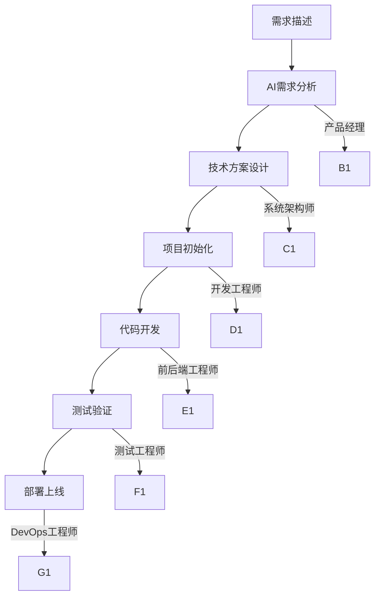

<div align="center">

# 🚀 Trae AI 超级团队

**一个命令，20个AI专家为你工作！**

[](https://www.python.org/)
[](LICENSE)

### 🎯 **复制即用 · 零配置 · 20个AI专家协作开发**

**中文友好 | 跨平台支持 | 企业级开发工作流**

</div>

---

## 📚 文档使用指南

### 🎯 学习路径（推荐顺序）

1. **[项目主页](README.md)** ← 你现在在这里
   - 项目全貌展示
   - 30秒快速开始
   - 20个AI专家团队介绍

2. **[核心原则速查](.trae/principles.md)** 📋
   - 3分钟掌握12大核心原则（新增测试优先、安全优先、性能优化、可持续维护）
   - 完整开发闭环：需求→设计→开发→部署→协作
   - 快速检查清单 + 决策工具 + 实战案例

3. **[技术架构](.trae/README.md)** 🔧
   - 系统内部技术细节
   - 20个AI智能体完整介绍
   - 故障排除指南

4. **[完整手册](.trae/rules/project_rules.md)** 📖
   - 详细使用指南
   - 工作流自动化
   - 高级配置技巧

### 🎪 快速选择

| 用户需求 | 推荐文件 | 阅读时间 |
| -------- | -------- | -------- |
| **快速上手** | principles.md | 3分钟 |
| **完整学习** | rules/project_rules.md | 15分钟 |
| **技术细节** | .trae/README.md | 10分钟 |
| **项目展示** | README.md | 5分钟 |

---

## ✨ 核心特性

<div align="center">

|   🎭**20个AI专家**   | 🚀**一键启动** | 🔧**零配置** | 📱**跨平台** |
| :------------------------: | :------------------: | :----------------: | :----------------: |
| 产品经理+架构师+开发工程师 |   一个命令开始开发   |      复制即用      |   Win/Mac/Linux   |

| 🎯**项目模板** | 🔄**智能协作** | 📊**企业级** | 🌐**中文优先** |
| :------------------: | :------------------: | :----------------: | :------------------: |
|    7种技术栈模板    |    AI团队协同工作    |    生产环境就绪    |     完整中文支持     |

</div>

---

## 🎬 30秒快速开始（模板自动化版）

### 🎯 方式1：模板自动化（全新推荐）

```bash
# 1. 一键启动模板控制台
python .trae/quick-start.py

# 2. 描述你的项目需求
"创建一个Vue3电商网站，需要用户登录、商品管理、购物车、支付功能"

# 3. AI自动完成：
#   ✅ 项目初始化文档
#   ✅ 需求分析文档
#   ✅ API接口规范
#   ✅ 数据库设计方案
#   ✅ 测试计划用例
#   ✅ Docker部署配置
```

### 🎯 方式2：快速项目创建

```bash
# Vue3项目（电商网站）
python .trae/workflows/trae-console-enhanced.py quick --type vue3 --name my-ecommerce

# FastAPI项目（用户系统）
python .trae/workflows/trae-console-enhanced.py quick --type fastapi --name my-api

# Flutter项目（移动应用）
python .trae/workflows/trae-console-enhanced.py quick --type flutter --name my-mobile-app
```

### 🎯 方式3：模板组合使用

```bash
# 手动选择模板组合
python .trae/workflows/template-manager.py interactive

# 选择：
# - project-init-template     # 项目初始化
# - requirements-template     # 需求分析
# - api-spec-template        # API规范
# - database-design-template # 数据库设计
# - test-plan-template       # 测试计划
```

---

## 🎭 20个AI专家团队

### 👔 管理层 (4人)

| 角色                 | 专长               | 使用示例                         |
| -------------------- | ------------------ | -------------------------------- |
| **产品经理**   | 需求分析、产品设计 | `@产品经理 设计一个Todo应用`   |
| **系统架构师** | 技术架构、系统设计 | `@系统架构师 微服务如何拆分？` |
| **项目经理**   | 项目规划、进度管理 | `@项目经理 制定开发计划`       |
| **项目协调员** | 团队协作、任务分配 | `@项目协调员 分配开发任务`     |

### 💻 前端开发 (5人)

| 角色                    | 技术栈                    | 使用示例                               |
| ----------------------- | ------------------------- | -------------------------------------- |
| **Vue工程师**     | Vue3 + TypeScript + Vite  | `@Vue工程师 创建响应式表格组件`      |
| **React工程师**   | React18 + Hooks + Next.js | `@React工程师 实现状态管理`          |
| **Angular工程师** | Angular15+企业级开发      | `@Angular工程师 设计模块化架构`      |
| **Uniapp工程师**  | 小程序 + App跨平台        | `@Uniapp工程师 开发微信小程序`       |
| **Flutter工程师** | 跨平台移动应用            | `@Flutter工程师 创建iOS/Android应用` |

### 🔧 后端开发 (5人)

| 角色                    | 技术栈                | 使用示例                          |
| ----------------------- | --------------------- | --------------------------------- |
| **Python工程师**  | FastAPI/Django/Flask  | `@Python工程师 设计RESTful API` |
| **FastAPI工程师** | FastAPI专业开发       | `@FastAPI工程师 创建高性能API`  |
| **Node工程师**    | Express/Nest.js服务端 | `@Node工程师 实现GraphQL接口`   |
| **Go工程师**      | Go语言高性能后端      | `@Go工程师 开发微服务`          |
| **Rust工程师**    | Rust系统级开发        | `@Rust工程师 实现高并发服务`    |

### 🎯 专项技术 (6人)

| 角色                     | 专长                 | 使用示例                         |
| ------------------------ | -------------------- | -------------------------------- |
| **测试工程师**     | 自动化测试、质量保证 | `@测试工程师 设计测试用例`     |
| **DevOps工程师**   | CI/CD、容器化部署    | `@DevOps工程师 配置Docker部署` |
| **UI/UX设计师**    | 界面设计、用户体验   | `@UI/UX设计师 设计现代化界面`  |
| **技术文档工程师** | 文档编写、API文档    | `@技术文档工程师 生成API文档`  |
| **C++部署工程师**  | C++系统部署优化      | `@C++部署工程师 优化系统性能`  |
| **环境管理工程师** | 统一环境配置和管理   | `@环境管理工程师 配置开发环境` |

---

## 🚀 模板自动化系统（全新升级）

### 📋 10大核心模板（一键应用）

#### 🎯 项目启动类（3个）
| 模板名称 | 用途 | 自动生成内容 | 使用场景 |
|---------|------|-------------|----------|
| `project-init-template` | 项目初始化指南 | 项目结构、技术栈、开发规范 | 新项目开始 |
| `requirements-template` | 需求分析文档 | 用户故事、功能清单、验收标准 | 需求澄清 |
| `tech-choice-template` | 技术选型对比 | 技术对比表、优缺点分析、推荐方案 | 技术决策 |

#### 🏗️ 系统设计类（4个）
| 模板名称 | 用途 | 自动生成内容 | 使用场景 |
|---------|------|-------------|----------|
| `api-spec-template` | API接口规范 | RESTful API、认证授权、错误处理、示例代码 | 后端开发 |
| `database-design-template` | 数据库设计 | 表结构、关系设计、性能优化、安全设计 | 数据建模 |
| `deployment-template` | 部署方案 | Docker配置、CI/CD、监控告警、环境配置 | 上线部署 |
| `code-review-template` | 代码审查 | 审查清单、问题追踪、改进建议、最佳实践 | 质量保证 |

#### ✅ 质量保证类（3个）
| 模板名称 | 用途 | 自动生成内容 | 使用场景 |
|---------|------|-------------|----------|
| `test-plan-template` | 测试计划 | 测试策略、用例设计、进度安排、风险分析 | 质量保障 |
| `agent-template` | AI智能体配置 | 20个AI专家角色配置、协作流程 | 团队协作 |
| `principle-driven-template` | 开发原则 | 6大核心开发原则、实施指南、检查清单 | 规范制定 |

### 🎯 即用项目模板（7种技术栈）

| 模板类型 | 技术栈 | 一键创建命令 | 适用场景 |
|---------|--------|-------------|----------|
| **🌐 Web应用** | Vue3 + FastAPI + PostgreSQL | `python .trae/quick-start.py` → 选择vue3 | 管理后台、企业应用 |
| **🛒 电商平台** | React18 + Node.js + MongoDB | `python .trae/quick-start.py` → 选择react | 在线商城、交易系统 |
| **📱 移动应用** | Flutter + Firebase | `python .trae/quick-start.py` → 选择flutter | 跨平台App |
| **💬 小程序** | Uniapp + SpringBoot | `python .trae/quick-start.py` → 选择uniapp | 微信/支付宝小程序 |
| **⚡ API服务** | FastAPI + PostgreSQL | `python .trae/quick-start.py` → 选择fastapi | 后端API服务 |
| **📝 静态网站** | Next.js + Vercel | `python .trae/quick-start.py` → 选择nextjs | 博客、官网 |
| **🖥️ 桌面应用** | Electron + Vue3 | `python .trae/quick-start.py` → 选择electron | 跨平台桌面软件 |

---

## 🎯 模板自动化使用案例（全新）

### 案例1：Vue3电商网站（模板自动化演示）

```bash
# 1. 启动模板控制台
python .trae/quick-start.py

# 2. 描述需求（自然语言）
"创建一个Vue3电商网站，需要用户登录、商品管理、购物车、支付功能"

# 3. AI自动完成（30分钟内）：
# ✅ 项目初始化文档（project-init-template）
# ✅ 完整需求分析（requirements-template）
# ✅ RESTful API规范（api-spec-template）
# ✅ 数据库设计方案（database-design-template）
# ✅ 测试计划用例（test-plan-template）
# ✅ Docker部署配置（deployment-template）

# 4. 开始AI协作开发
"@Vue工程师 创建商品列表组件"
"@Python工程师 设计商品管理API"
"@测试工程师 编写商品测试用例"
```

### 案例2：FastAPI用户系统（一键生成）

```bash
# 快速创建完整项目
python .trae/workflows/trae-console-enhanced.py quick \
  --type fastapi \
  --name user-auth-system \
  --features "用户注册 登录认证 JWT令牌 权限管理 文件上传"

# 自动生成：
# 📁 项目结构
# 📋 需求文档（requirements.md）
# 🔧 API规范（api-spec.md）
# 🗄️ 数据库设计（database-design.md）
# ✅ 测试计划（test-plan.md）
# 🚀 部署方案（deployment.md）
```

### 案例3：模板组合使用（高级用法）

```bash
# 手动选择模板组合
python .trae/workflows/template-manager.py interactive

# 选择以下模板：
# 1. project-init-template     # 项目初始化
# 2. requirements-template     # 需求分析
# 3. api-spec-template        # API规范
# 4. database-design-template # 数据库设计
# 5. test-plan-template       # 测试计划

# AI智能填充内容：
# - 根据项目类型自动推荐技术栈
# - 根据功能需求自动生成API接口
# - 根据业务场景自动设计数据库表
# - 根据开发周期自动安排测试计划
```

## 📊 模板自动化效率对比

| 开发阶段 | 传统方式 | Trae AI模板 | 节省时间 | 质量提升 |
|---------|----------|-------------|----------|----------|
| 项目初始化 | 2-4小时 | 5分钟 | 95% | ✅ 标准化 |
| 需求文档 | 4-6小时 | 10分钟 | 90% | ✅ 结构化 |
| API设计 | 2-4小时 | 15分钟 | 85% | ✅ RESTful |
| 数据库设计 | 2-3小时 | 10分钟 | 80% | ✅ 规范化 |
| 测试计划 | 2-3小时 | 15分钟 | 85% | ✅ 全覆盖 |
| 部署配置 | 1-2小时 | 5分钟 | 90% | ✅ 生产级 |
| **总计** | **13-22小时** | **1小时** | **90-95%** | **企业级** |

---

## 🛠️ 开发工作流

### 🔄 标准开发流程



### 📊 项目生命周期

1. **需求阶段** - 产品经理分析需求
2. **设计阶段** - 架构师设计系统
3. **开发阶段** - 前后端工程师编码
4. **测试阶段** - 测试工程师验证
5. **部署阶段** - DevOps工程师上线

---

## 📖 文档体系说明

### 双层文档结构

我们提供了两个层次的文档，满足不同用户需求：

**📋 项目主页文档**（你正在看的这个）

- 📍 **面向**：所有GitHub访客和新手用户
- 📚 **内容**：项目介绍、快速开始、使用案例、项目模板
- 🎯 **用途**：了解项目、快速上手、技术选型

**🔧 系统内部文档**

- 📍 **面向**：实际使用Trae系统的开发者
- 📚 **内容**：详细技术架构、20个AI智能体完整介绍、故障排除、高级配置
- 📂 **位置**：`.trae/README.md`
- 🎯 **用途**：深度使用、问题排查、高级功能

### 📋 如何根据需求选择文档

| 你的需求             | 推荐阅读                               |
| -------------------- | -------------------------------------- |
| 第一次了解项目       | 继续阅读当前页面                       |
| 准备开始使用         | 查看下方"🎬 30秒快速开始"              |
| 需要详细技术文档     | 查看 `.trae/README.md`               |
| 遇到问题需要排查     | 查看 `.trae/README.md`的故障排除部分 |
| 想了解20个AI专家详情 | 查看 `.trae/README.md`的智能体介绍   |

---

## 🎯 快速开始指南

### 🏃‍♂️ 极速体验（30秒）

```bash
# 进入项目目录
cd learn_trae

# 2. 启动AI控制台
python .trae\trae-console.py

# 3. 输入需求开始开发！
```

### 📚 新手入门（3天计划）

#### 第1天：熟悉系统

```bash
# 启动控制台
python .trae\trae-console.py

# 尝试："创建一个简单的Hello World应用"
# 观察19个AI如何协作
```

#### 第2天：项目实践

```bash
# 创建第一个完整项目
python .trae-dev.py "@产品经理 创建一个Vue3待办事项应用"
```

#### 第3天：专业咨询

```bash
# 向专业智能体提问
python .trae-dev.py "@系统架构师 如何设计微服务架构？"
python .trae-dev.py "@Vue工程师 Vue3的Composition API最佳实践？"
```

---

## 🔧 高级功能

### 🎛️ 控制台命令

```bash
# 查看所有智能体
python .trae\trae-console.py list-agents

# 创建特定类型项目
python .trae\trae-console.py create --type vue3 --name my-app

# 专业咨询
python .trae\trae-console.py consult "@技术栈选择" "前端框架对比"

# 项目列表
python .trae\trae-console.py list

# 项目详情
python .trae\trae-console.py show [项目名]
```

### 🎯 专业咨询示例

```bash
# 架构咨询
python .trae-dev.py "@系统架构师 单体架构vs微服务如何选择？"

# 技术选型
python .trae-dev.py "@Python工程师 FastAPI和Django哪个更适合API开发？"

# 性能优化
python .trae-dev.py "@DevOps工程师 如何优化Docker镜像大小？"
```

---

## 🌟 社区和贡献

### 🤝 如何贡献

我们欢迎所有形式的贡献！

- 🐛 **报告Bug** - 创建Issue
- 💡 **功能建议** - 提交Feature Request
- 📖 **文档改进** - 完善README
- 🌍 **翻译贡献** - 多语言支持
- 🎨 **模板创建** - 添加新项目模板

### 📊 开发路线图

- [ ] 智能代码审查
- [ ] 性能监控面板
- [ ] 云端部署集成
- [ ] 团队协作功能
- [ ] VSCode插件
- [ ] 移动端管理App

## 📄 许可证

本项目采用 [MIT 许可证](LICENSE) - 查看 [LICENSE](LICENSE) 文件了解详情。

---

## 🙏 致谢

感谢以下项目给予灵感和支持：

- [LangChain](https://github.com/langchain-ai/langchain) - AI应用框架
- [FastAPI](https://github.com/tiangolo/fastapi) - 现代Python Web框架
- [Vue.js](https://github.com/vuejs/vue) - 渐进式JavaScript框架
- [React](https://github.com/facebook/react) - 用户界面库

---

<div align="center">

### 🎯 **让20个AI专家为你的项目工作！**

**[🚀 立即开始](#-30秒快速开始) · [📖 查看文档](#-快速开始指南)**

</div>
